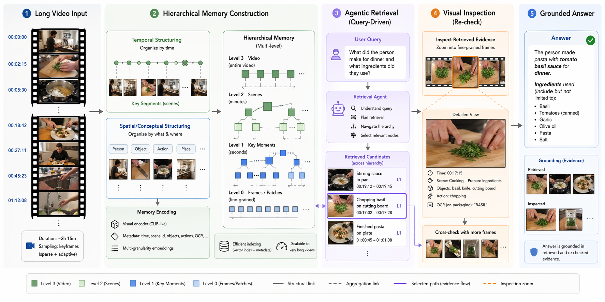

<p align="center">
  
</p>

<h1 align="center">Visual Agentic Memory (VAM)</h1>

<p align="center">
  <b>Visual Agentic Memory (VAM)</b> transforms unconstrained video streams into hierarchical visual memory, supports query-driven agentic retrieval, and grounds answers through visual inspection.
</p>

## Motivation

VAM is designed for settings where relevant evidence is sparse, temporally distant, and difficult to localize with single-pass video reasoning. Rather than repeatedly scanning the full video, VAM performs online indexing into a persistent memory structure and retrieves only the most relevant evidence for downstream reasoning and verification.

<p align="center">
  
</p>

## Key Components

- **Online Indexing with Adaptive Deduplication**: A memory construction pipeline that identifies boundary-sensitive moments under strict online streaming constraints using an adaptive thresholding mechanism.
- **Hierarchical Memory with Parallel Representation**: A structured memory architecture that organizes moments and events across temporal tiers, balancing scalable storage with the preservation of recoverable visual details.
- **Agentic Retrieval for Grounded Reasoning**: A multi-turn retrieval loop in which an MLLM acts as a retrieval agent to search, inspect, and summarize evidence for auditable reasoning over distant events.
- **Training-free End-to-end Framework**: An integrated system that supports streaming perception and long-horizon retrieval using pre-trained multimodal components without task-specific retraining.

## Project Layout

- `vam/video.py`: video indexing pipeline used by both the TUI and the server.
- `vam/retrieval/`: memory store, indexing, search, and persistence.
- `vam/agent.py`: planning and response orchestration.
- `vam/vision/`: embedding client integration.
- `vam/tui.py`: packaged terminal interface.
- `vam/server/`: optional FastAPI and WebSocket entry points.
- `vam/cli.py`: console entry points for `vam-tui` and `vam-server`.

## Requirements

- Python `3.10+`
- FFmpeg installed on the host system

Install FFmpeg before running VAM:

```bash
# macOS
brew install ffmpeg

# Ubuntu / Debian
sudo apt update && sudo apt install -y ffmpeg

# Windows (Chocolatey)
choco install ffmpeg
```

If you do not use Chocolatey on Windows, install FFmpeg manually from [ffmpeg.org](https://ffmpeg.org/download.html).

## Installation

Clone the repository and install the package:

```bash
pip install .
```

This installs the Python dependencies and exposes two console commands:

- `vam-tui`
- `vam-server`

If you prefer `uv`, run the packaged entry points through an ephemeral install:

```bash
uv run --with . --python 3.11 vam-tui
uv run --with . --python 3.11 vam-server
```

## Configuration

Create a local environment file:

```bash
cp .env.example .env
```

Set at least:

- `OPENROUTER_API_KEY`

Common optional variables:

- `LLM_MODEL` default: `google/gemini-3-flash-preview`
- `EMBEDDING_MODEL` default: `google/gemini-embedding-2-preview`
- `FRAME_STORE_PATH` default: `data/frame_store.sqlite3`

## Usage

### Terminal TUI

Start the local terminal interface:

```bash
vam-tui
```

The TUI supports:

- indexing a video from a local path
- asking retrieval questions over stored memory
- generating summaries over selected time ranges
- browsing indexed memory and recent event documents

### Optional API Server

Start the server:

```bash
vam-server
```

Default endpoints:

- HTTP root: `http://localhost:8000/`
- Swagger docs: `http://localhost:8000/docs`
- WebSocket agent: `ws://localhost:8000/ws/agent`

You can override the port with `PORT`:

```bash
PORT=8011 vam-server
```

## Example Queries

After indexing a video, example questions include:

- "What happened right after I left the kitchen?"
- "Find the scene where I was sitting on the sofa but not watching TV."
- "How many times did I pick up a cup?"
- "Summarize the first 30 minutes, focusing on kitchen activity."

## Notes

- The package requires Python `3.10+`. A system `python3` on macOS may still point to `3.9`, which is not supported.
- FFmpeg is an external system dependency and is not installed by `pyproject.toml`.
- The TUI is the primary interface. The server is optional rather than the core product surface.

## License

This project is released under the [MIT License](LICENSE).
